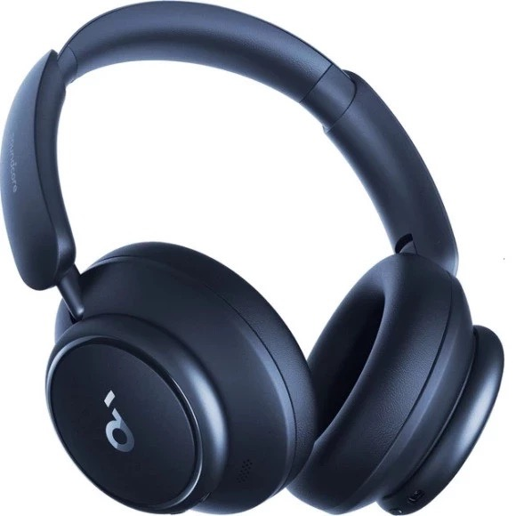
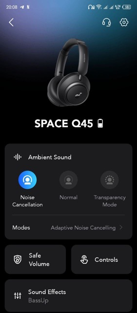
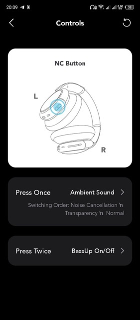
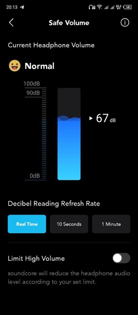
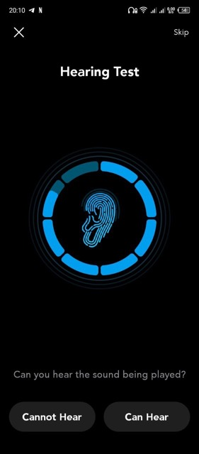
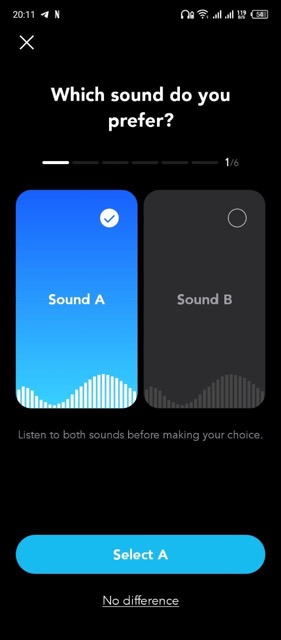

# Вражаючий звук та комфортний дизайн: [Anker Soundcore Space Q45](https://soundmag.ua/uk/besprovodnye-naushniki-anker-soundsore-space-q45-blue.html 'Сторінка на soundmag.ua')

**_Привіт усім меломанам та аудіофілам!_**

Сьогодні ми з вами розглянемо навушники Anker Soundcore Space Q45(далі просто Q45), що являються вражаючим зразком звукових технологій, та поєднують в собі потужній аудіоперформанс і комфортний дизайн.

Як шанувальник музики і якісного звуку, я захоплююсь новими девайсами, які допомагають насолоджуватися музикою ще більше. І саме Q45 вразили мене своїм вражаючим звуком та зручністю використання. Разом зі мною ви дізнаєтесь про їхні технічні характеристики, комплектацію, дизайн і комфорт. Готові погрузитися у світ якісного аудіо? Давайте почнемо!

---

### Технічні характеристики

- Тип навушників: Повнорозмірні
- Тип підключення: Bluetooth, 3.5mm
- Призначення: Для Android, Для iPhone, Для дому, Для телефону
- Акустичне оформлення: Закриті
- Тип кріплення: Наголов'я
- Тип випромінювача: Динамічний
- Імпеданс, Ом: 16
- Матеріал корпусу: Метал
- Наявність мікрофону: Універсальний
- Диапазон частот, Гц: 20 - 40000
- Кількість випромінювачів: 1
- Складні: Так
- Колір: Чорний, Білий, Синій
- Активне шумопоглинання: Так
- Гарантія: 18 місяців

### Особливості

- Режим активного шумоподавлення з 5 рівнями прозорості
- 40-мм драйвери з двошаровою діафрагмою з шовку та кераміки
- Підтримка кодека LDAC для бездротового звуку Hi-Res Audio
- Можливість підключення у 2 пристрої одночасно
- Елегантний та ергономічний дизайн, амбушури з ефектом пам'яті

### Комплектація

- Навушники
- Зарядний кабель USB-A - USB-C
- Чохол для зберігання та перенесення
- Інструкція з експлуатації

---

## Дизайн і комфорт

Q45 мають стильний і сучасний дизайн, що гармонійно поєднується з їхніми функціональними можливостями. Вони мають ергономічну форму та добре пасують до різних розмірів голови. Це дозволяє їм зручно сидіти і надійно фіксуватися, незалежно від активності, що забезпечує комфорт під час довгого використання.

Важливо, що Q45 дають високий рівень комфорту. Вони оснащені м'якими амбушурами, які приємно прилягають до вух і забезпечують затихаючий ефект, зменшуючи шум зовнішнього середовища. Це особливо корисно, коли ви слухаєте музику або дивитеся фільми в перенасиченому звуком оточенні.

Крім того, легка конструкція навушників дозволяє їм бути зручними для носіння навіть протягом тривалого часу. Ви можете насолоджуватися улюбленою музикою чи використовувати їх під час тренувань без відчуття дискомфорту або втоми.

---

## Керування

Q45 мають інтуїтивно зрозуміле керування за допомогою кнопок, що мають зручний розмір, та легко знаходятся на дотик.

Ви можете легко регулювати гучність, перемикати треки, змінювати режими ANC та профілі єквалайзеру, та приймати виклики без потреби витягувати телефон з кишені. Це дозволяє зберегти зручність і вільні руки під час користування навушниками.

На мій подив, навушники не вміють вимикати музику автоматично при знятті іх з голови. Перші декілька днів було незвично, але згодом рука звикла натискати клавішу паузи перед зняттям.

Також Soundcore мають власний додаток для своїх пристроїв, доступний як на Android, так і для iPhone. Для перевірки його можливостей, я використовував Android, тож усі скріншоти будуть саме з цієї версії.

Головний єкран дозволяє вибрати пристрій, що буде важливимдля власників одразу декількох девайсів від Soundcore. Після натискання на тайл з зображенням Space Q45, потрапляємо до сторінки з інформацією про стан підключення та налаштуваннями.

Додаток має чудову можливість переназначити комбінації клавіш, та встановити максимальній рівень гучності.

Якщо вам не до вподоби заводські частоти єквалайзеру, можливо зробити декілька кастомних, та швидко перемикатися між ними при потребі. Є окремий профіль HeartID, у котрому частоти будуть відкалібровані під ваш слух та вподобання.

---

## Звук

- Низькі частоти

  Навушники Q45 відтворюють низькі частоти з вражаючою силою та глибиною. Завдяки високоякісним динамікам і технології звуку, ви будете насолоджуватися потужними та драйвовими басами, які проникають глибоко і створюють іммерсивний звуковий досвід. Це особливо чудово підходить для жанрів музики, які вимагають сильних басів, таких як хіп-хоп або рок.

- Середні частоти

  У середньому діапазоні навушники Q45 пропонують чіткість і деталізацію. Вокал звучить чисто і живо, інструменти мають виразність і природність. Незалежно від того, чи ви слухаєте класичну музику, популярні хіти або аудіокниги, середні частоти навушників Q45 забезпечують детальний і чистий звук.

- Високі частоти

  У високому діапазоні навушники Q45 передають високі частоти з ясністю і непоганою деталізацією. Вони відтворюють високі ноти, дзвінкі звуки і шуми з натуральністю та без спотворень. Це дозволяє вам насолоджуватися деталями сольних партій і перкусії, а також отримувати чіткість у вокальних виконаннях.

До того як до мене потрапили Q45, я близько двух місяців використовував дуже схожі по характеристикам Knowledge Zenith H10.

На мою думку, Q45 пропонують більш збалансований і вражаючий звуковий діапазон. Вони мають дуже потужні низьки частоти, чисті середні та детальні високі. Добре підходять для самих різних жанрів музики, і особливо для року. Також у Q45 кращий ANC, керування, і є можливість налаштування через додаток на смартфоні.

У свою чергу H10 мають гарно акцентований бас і виразні високі частоти, що дозволяє їм відтворювати дуже динамічний звук у танцювальних жанрах музики.

---

## Час роботи від батареї

Завдяки ємній батареї, ви зможете використовувати навушники на протязі близько 30 годин. Це дозволяє насолоджуватися своєю улюбленою музикою, подкастами або аудіокнигами протягом декількох днів без необхідності постійного заряджання. Це особливо зручно для подорожей, тренувань або довгих робочих сесій.

---

## Висновок

Q45 є вражаючим варіантом для меломанів, які шукають якісний звук та комфорт у використанні. Навушники вражають своїми потужними низькими частотами, чистими середніми та детальними високими, забезпечуючи вам збалансований звуковий діапазон. З активним шумозаглушенням і зручним дизайном, Q45 дозволяють вам зануритися в музику без перешкод, та насолоджуватися комфортним та тривалим використанням.

- Плюси

  - Вражаючий звуковий діапазон з потужними низькими, чистими середніми та детальними високими
  - Активне шумозаглушення для поглинання навколишніх шумів
  - Ергономічний дизайн та комфортне носіння
  - Гарний час роботи від батареї, що дозволяє тривале використання без постійного заряджання
  - Дуже зручне керування на навушниках
  - Можливість налаштування через додаток

- Мінуси

  - Можуть бути трохи дорожчими в порівнянні з іншими моделями
  - Немає датчику для автоматичного увімкнення паузи при зніманні навушників з голови
