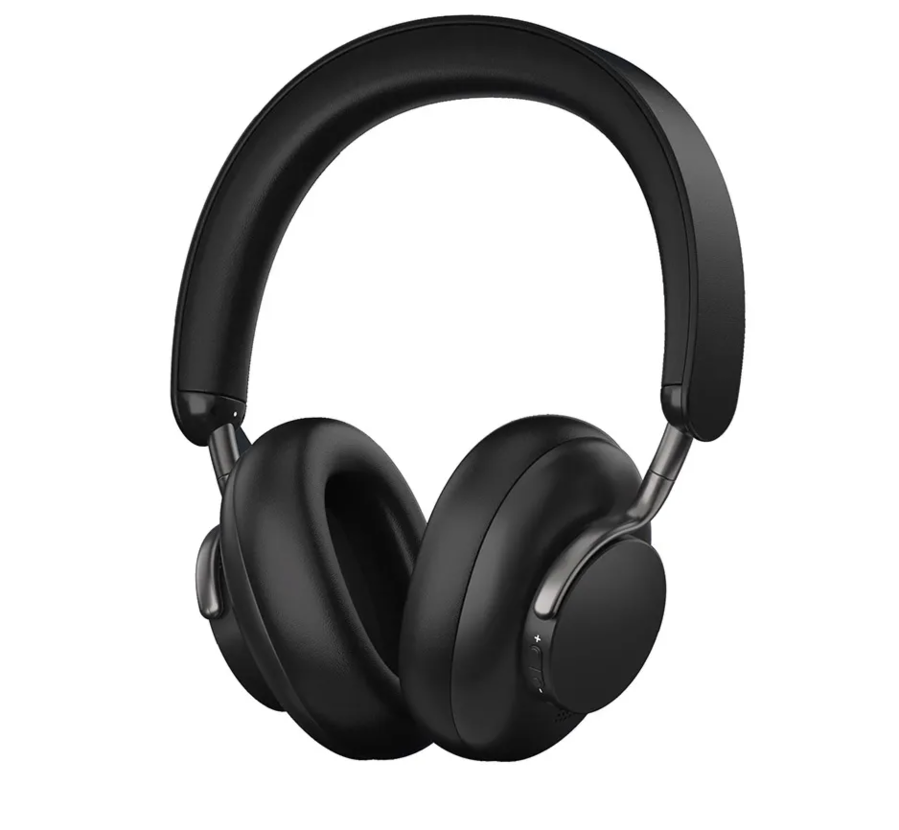

# [Knowledge Zenith H10](https://soundmag.ua/uk/bezprovidni-navushniki-knowledge-zenith-h10-over-ear-headphone-anc-black.html 'Сторінка Knowledge Zenith H10 на soundmag') - Найкращі навушники з шумодавом?

---

Цей огляд зосереджений на нових бездротових шумопоглинаючих навушниках Knowledge Zenith H10, які в певних аспектах подривають позиції деякіх з більш відомих брендів завдяки яскравому звучанню, – не кажучи вже про бюджетну ціну!

Вони добре виглядають, зручні, мають заряд акумулятора флагманського рівня та чудовий звук. Давайте зануримось та дізнаємося більше!

---

## Технічні характеристики

- Форма: Повнорозмірні навушники
- Диапазон частот, Гц: 20 Гц-20 кГц
- Імпеданс: 32 Ом
- Чутливість: 116±3dB/mW
- Динамік: динамічна діафрагма з титановим покриттям 40 мм
- Ємність акумулятора: 500mAh
- Час роботи від батареї: ~25 годин з увімкненим ANC, ~30 годин у пасивному режимі
- Bluetooth: версія 5.0 (діапазон >10 м)
- Входи: USB-C для заряджання та дротовий аудіороз'єм 3.5 мм
- Вбудований мікрофон: Так
- Вага: 282±10г

> #### Про виробника
>
> 
>
> Knowledge Zenith(далі KZ), або «Зеніт знань», виник у Китаї трохи більше десяти років тому. Він найбільш відомий як бюджетний бренд IEM, і його список продуктів це підкреслює. Засновниками є Кейт Юе, колишній інженер Audio-Technica, і Дзен Лі, класичний музикант із західною освітою.

## Комплектація

KZ H10 поставляєтся у лаконічній чорній коробці, з тонкими фіолетовими вигравіруваними зображеннями.

> 
>
> Чудове перше враження, особливо за такої низької ціни.

У комплекті є переносний кейс компактного розміру (22см \* 20см), що дозволяє помістити його у будь-який невеличкий рюкзак чи сумку.

> 
>
> Чохол виготовлений з міцного матеріалу сірого кольору, який забезпечує додатковий захист від будь-яких пошкоджень.

Навушники, буклет з інструкціями, зарядний кабель USB-A -> USB-C і двосторонній 3.5 мм кабель TRRS знаходяться всередині футляра.

> 
>
> Вставляти KZ H10 у кейс складніше ніж хотілося б. Це дрібниця, але те, що ви помітите, якщо користуєтеся чохлом регулярно.

Мені здається, що ми підходимо до моменту, коли двосторонній кабель USB-C буде кращим, але USB-A все ще досить розповсюджений.

---

## Дизайн і комфорт

KZ H10 на мою думку, є дуже привабливою парою повнорозмірних навушників, і Knowledge Zenith слід похвалити за те, чого вони досягли за цю ціну.

Амбушюри з 40-міліметровим динаміком зроблені з простого чорного пластику без брендування.

Це допомагає дизайну зберегти елегантний, простий вигляд, хоча, я вважаю що на ньому залишаються відбитки пальців, якщо ваші руки жирні чи спітнілі. Волога ганчірка легко видаляє плями.

> 
>
> Амбушюри виготовлені зі штучної шкіри і є досить зручними для тривалого прослуховування.

Комфорт продовжується завдяки наголів’ю, яке щедро підбито тим же матеріалом, що й амбушюри. Я не помітив точки тиску на маківці, чого я не можу сказати про мої власні навушники ANC, які коштують у чотири рази більше!

> 
>
> KZ H10 комфортно сидять на моїх відносно великих вухах, мають глибокі чашечки, що дозволяє мені без проблем користуватися ними в окулярах.

Амбушюри можна повертати на 90 градусів, що зручно для тих, хто в русі, також є мінімальне вертикальне регулювання.

> 
>
> Висувний метал виглядає приємним і глянцевим.

Також під час скручування я не виявив сторонніх скрипів і звуків, як це зазвичай буває у бюджетних повнорозмірних навушників інших виробників.

> 
>
> Сила затиску і вага мені ідеальні.

Єдина область, де я хотів би покращити дизайн, це маленькі кнопки, встановлені по краю чашок.

> 
>
> Одна відповідає за живлення, перемикання між режимами активного та пасивного шумопоглинання, режимом прозорості, та приняття/відхилення вхідних викликів якщо ви плануєте користуватись навушниками зі смартфоном.
>
> 
>
> Інші дві кнопки потрібні для збільшення/зменшення гучності. Натискання відчуваются дуже чітко.

Я б віддав перевагу більш витягнутому дизайну, щоб їх було легше знайти та використовувати під час носіння навушників.

---

## Звук

Тепер ми переходимо до найцікавішого, - як вони звучали?

> 
>
> Для прослуховування через Bluetooth я вів потокову передачу зі свого телефону Android і Macbook.

KZ H10 комфортні для прослуховування як вдома, так і в шумних місцях. Затестив в метро - всі треки звучали добре, ніяких нарікань я не виявив.

Як показала практика, рівень гучності навушників мав гарний запас. Навіть я б сказав дуже сильний запас, тому слухати музыку на 100% гучності, я взагалі не можу рекомендувати.

Якщо ж говорити безпосередньо про звукову сигнатуру навушників, H10 створили тут перлину, особливо для любителів електронної музики. Звучання тепле та не втомлює.

На окрему увагу заслуговують теплі, фактурні, але зовсім не розмиті тембри, що сприяють швидкому залученню до прослуховування.

- #### **_Бас_**

  KZ H10 впевнено справляється з нижними частотами, з надійним розширенням до рівня суббасів. Є хороший рівень динаміки, з різкістю в електронній танцювальній музиці, яку я оцінив одразу. Верхній бас трішки більше квадратний і темний, але не настільки, щоб відволікати.

  У числі інших заслуг басу KZ H10 хитливість, непогана читаність, здатність досягати правильних глибин, підвищена енергійність і задовільні швидкісні характеристики.

- #### **_Середні частоти_**

  Середня частина KZ H10 більш втоплена. Не занадто, але достатньо, щоб їх важче було рекомендувати для більш критичного прослуховування. Я порівняв їх із шумопоглинаючими навушниками Sony WH1000XM5 і помітив набагато більше деталей, ніж KZ H10 може розпізнати, особливо щодо вокалу, гітари та фортепіано.

  Знову ж таки, пам’ятайте про різницю в ціні між даними наборами.

  Хороша новина полягає в тому, що м’які середні частоти сприяють розслабленню тривалого прослуховування, і багато слухачів насолоджуються більш V-подібним звуковим підписом.

- #### **_Високі частоти_**

  Повертаючись до сильних сторін KZ H10, верхня частина солодка, хоча трохи м’яка. Часом я відчував, що не вистачає блиску, як, наприклад, на фортепіано в «Основних цінностях» Нільса Фрама, які могли б мати трохи більше ясності, але насправді я тут прискіпливий.

- #### **_Сцена_**

  Ось тут ще один важливий момент емоційності та виразності. Навушники добре концентруються на першому плані. Сам поділ планів трохи акцентований, і при цьому перший добре вирізняється на загальному тлі. Навколо нього будується сцена. І логічно що соліст тут отримує карт-бланш, своєрідний крок уперед. Він до одного боку додає виразності та переконливості, з іншого – робить вокал трохи більше “на обличчя”. Що чудово працює на емоційність.

- #### **_Мікрофони та шумопоглинання_**

  Варто витратити хвилину, щоб поговорити про шумопоглинання цих навушників, оскільки саме тут бюджетні моделі можуть боротися з дорожчими гравцями на ринку.

  Звичайно, ви не почуєте найкраще від KZ H10 з увімкненим шумопоглинання. У порівнянні з прослуховуванням у режимі пасивного шумопоглинання звук слабшає, втрачаючи частину своєї динамічної якості. У такому середовищі, де вам потрібен ANC, це здебільшого не буде проблемою, оскільки ви будете цінувати ізоляцію, а не насолоджуватися найкращою точністю.

  ANC виконує досить надійну роботу в сценаріях, де ця технологія зазвичай працює найкраще: де шум, який ви намагаєтеся зменшити, постійний, як у двигуні літака, чи вагоні метро. Мої навушники Sony ANC ще більше зменшують цей шум, але це в чотири рази дорожче.

  Моя рекомендація, особливо під час прослуховування вдома, полягає в тому, щоб віддати перевагу режиму пасивного шумопоглинання, у якому вони забезпечують найкращий звук. Вмикайте ANC лише тоді, коли вам це потрібно або коли ви подорожуєте, де ви майже не помітите ці незначні недоліки.

  Крім того, KZ H10 також має режим прозорості, який дозволяє чути голоси та інші звуки навколо вас, не знімаючи навушників.

Загалом, все дуже непогано навіть без особливих знижок на бюджет моделі. Навушники вийшли досить музичними, емоційними, тембристими, але досить детальними і технічними. Вони вміють грати різні жанри та стилі, вміють будувати масштабну і відносно точно зіткану стереопанораму, а також цілком нормально передають динаміку гри. На окрему увагу заслуговують теплі, фактурні, але зовсім не розмиті тембри, що сприяють швидкому залученню до прослуховування.

---

## Час роботи від батареї

Заявлений час автономної роботи для цих навушників становить ~25 годин з використанням ANC, і ~30 годин з пасивним шумопоглинанням. Це змінюватиметься залежно від реального використання, але під час мого тестування час автономної роботи від батареї здається чудовим. У мене не було жодних проблем, пов’язаних із цим, під час довгострокового використання.

Термін служби батареї KZ H10 є однією з його найсильніших характеристик, і це чудовий варіант для людей, які шукають бездротові навушники, які їм не потрібно часто заряджати.

---

## Висновок

Я припускаю, що вам, як і мені, потрібен комфорт, достатня ізоляція від галасливого зовнішнього світу та якість звуку, від якої ваші улюблені треки заграють по новому.

Це чудові навушники з ANC за таку ціну. Вони добре виглядають, зручні, мають заряд акумулятора флагманського рівня та чудовий звук. Що вам ще потрібно?

Я б сказав, що якщо ваш бюджет менший за 100$, то саме Knowledge Zenith H10 стане
чудовим вибором.

> 
>
> Гарне відтворення аудіо полягає в тому, щоб ми могли загубитися в нашій музиці, і KZ H10 легко закрили це питання.

#### Що мені сподобалось:

- Відмінна якість звуку в цій ціновій категорії.
- Дуже зручно для тривалого прослуховування.
- Час автономної роботи на рівні флагманів.

#### Що мені не сподобалось:

- Кейс міг би краще підійти для навушників.

---

Дякую інтернет-магазину [soundmag.ua](https://soundmag.ua) за люб'язно надані для огляду навушники.

Подивитись за якою адресою можливо послухати, а заразом і поміряти Knowledge Zenith H10 можна за [посиланням](https://soundmag.ua/uk/bezprovidni-navushniki-knowledge-zenith-h10-over-ear-headphone-anc-black.html).
