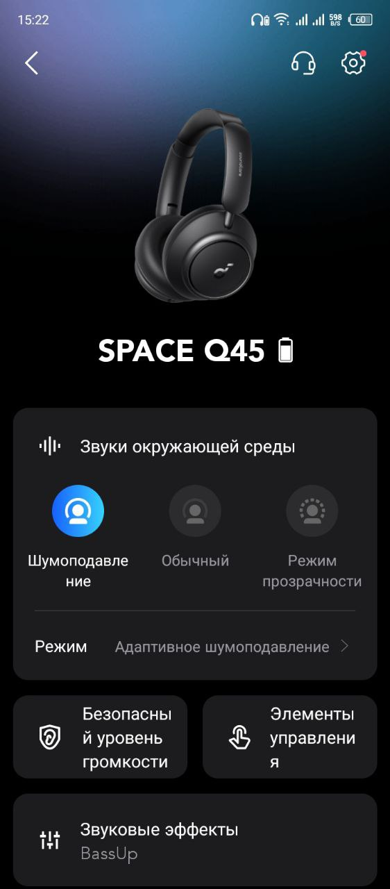
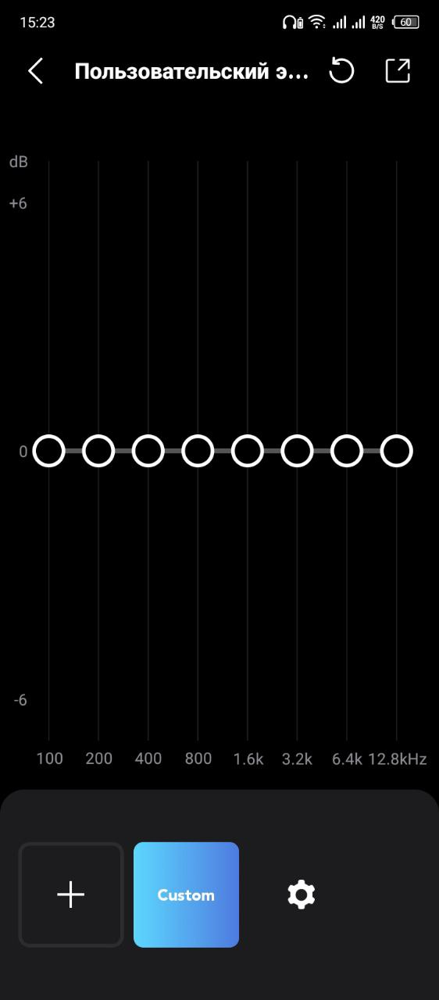

# Вражаючий звук та комфортний дизайн: [Anker Soundcore Space Q45](https://soundmag.ua/uk/besprovodnye-naushniki-anker-soundsore-space-q45-blue.html 'Сторінка на soundmag.ua')

### Привіт усім меломанам та аудіофілам!

Сьогодні ми з вами розглянемо Q45, що являються вражаючий зразком звукової технології, та поєднують в собі потужній аудіоперформанс і комфортний дизайн.

Як шанувальник музики і якісного звуку, я захоплююся новими продуктами, які допомагають мені насолоджуватися мелодіями ще більше. І саме Q45 вразили мене своїм вражаючим звуком та зручністю використання. Разом зі мною ви дізнаєтесь про їхні технічні характеристики, комплектацію, дизайн і комфорт. Готові погрузитися у світ якісної аудіоінтенсивності? Давайте розпочнемо огляд Anker Soundcore Space Q45!

---

### Технічні характеристики

- Тип навушників: Повнорозмірні
- Тип підключення: Bluetooth, Jack 3.5mm
- Призначення: Для Android, Для iPhone, Для дому, Для телефону
- Акустичне оформлення: Закриті
- Тип кріплення: Наголов'я
- Тип випромінювача: Динамічний
- Імпеданс, Ом: 16
- Матеріал корпусу: Метал
- Наявність мікрофону: Універсальний
- Диапазон частот, Гц: 20 - 40000
- Кількість випромінювачів: 1
- Складні: Так
- Колір: Чорний, Білий, Синій
- Активне шумопоглинання: Так
- Гарантія: 18 місяців

### Особливості

- Режим активного шумоподавлення з 5 рівнями прозорості.
- 40-мм драйвери з двошаровою діафрагмою з шовку та кераміки.
- Підтримка кодека LDAC для бездротового звуку Hi-Res Audio.
- Можливість підключення у 2 пристрої одночасно.
- Елегантний та ергономічний дизайн, амбушури з ефектом пам'яті.

### Комплектація

- Навушники
- Зарядний кабель USB-A - USB-C
- Чохол для зберігання та перенесення
- Інструкція з експлуатації

## Дизайн і комфорт

Q45 мають стильний і сучасний дизайн, що гармонійно поєднується з їхніми функціональними можливостями. Вони мають ергономічну форму та добре пасують до різних розмірів голови. Це дозволяє їм зручно лягати на вуха і надійно фіксуватися, незалежно від активності, що забезпечує комфорт під час довгого використання.

Q45 пропонують високий рівень комфорту. Вони оснащені м'якими амбушурами, які приємно прилягають до вух і забезпечують затихаючий ефект, зменшуючи шум зовнішнього середовища. Це особливо корисно, коли ви слухаєте музику або дивитеся фільми в перенасиченому звуком оточенні.

Крім того, легка конструкція навушників Q45 дозволяє їм бути зручними для носіння навіть протягом тривалого часу. Ви можете насолоджуватися своєю улюбленою музикою чи використовувати їх під час тренувань без відчуття дискомфорту або втоми.

Загалом, дизайн навушників Q45 поєднує елегантність і практичність, а їхній високий комфорт дозволяє вам насолоджуватися звуком без жодних перешкод.

## Керування

Q45 мають інтуїтивно зрозумілу панель керування на душці одного з навушників. Ви можете легко регулювати гучність, перемикати треки та приймати виклики без потреби витягувати телефон з кишені. Це дозволяє зберегти зручність і вільні руки під час користування навушниками.

## Додаток

Головний єкран додатку виглядає наступним чином:

Якщо натиснути на тайл з Space Q45, потрапляємо до сторінки с інформацією про стан підключення, та налаштуваннями навушників.

Якщо вам не до вподоби заводські частоти, можливо зробити декілька кастомних налаштувань єквалайзеру, та швидко перемикатися між ними при потребі.

Також, є налаштування комбінацій клавіш та безпечного рівню гучності.

## Звук

## Час роботи від батареї

## Висновок

## Мінуси

- Немає датчику для автоматичного увімкнення паузи при зніманні навушників з голови.
