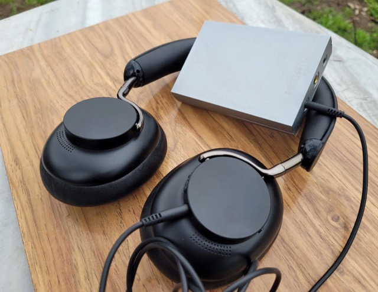
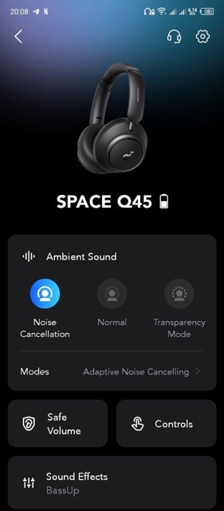
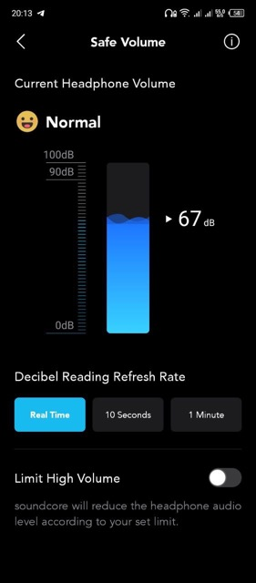
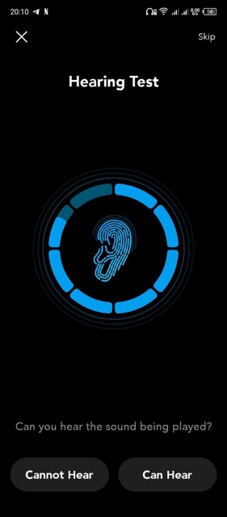
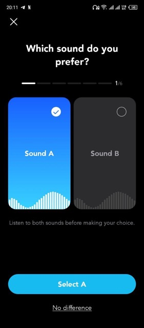

# [Anker Soundcore Space Q45](https://soundmag.ua/uk/besprovodnye-naushniki-anker-soundsore-space-q45-blue.html 'Сторінка на soundmag.ua') vs [Knowledge Zenith H10](https://soundmag.ua/uk/bezprovidni-navushniki-knowledge-zenith-h10-over-ear-headphone-anc-black.html 'Сторінка Knowledge Zenith KZ H10 на soundmag.ua')

**_Привіт усім меломанам та аудіофілам!_**

Сьогодні розглянемо дві пари навушників середньої цінової категорії

Хочу представити вам героїв нашого огляду, - Anker Soundcore Space Q45

та Knowledge Zenith H10

Розглянемо технічні характеристики, дизайн, керування і, звісно, звучання! І повірте, тут є що вам розповісти, тож починаємо!

---

## Технічні характеристики

Технічні характеристики досить схожі:

|                          | Anker Soundcore Space Q45 | Knowledge Zenith KZ H10 |
| :----------------------: | :-----------------------: | :---------------------: |
|      Тип навушників      |       Повнорозмірні       |      Повнорозмірні      |
|     Матеріал корпусу     |          Пластик          |     Пластик, Метал      |
|         Складні          |            Так            |           Так           |
| Кількість випромінювачів |             1             |            1            |
|     Розмір драйверу      |           40мм            |          40мм           |
|   Диапазон частот, Гц    |        20 - 40000         |       20 - 40000        |
|     Тип підключення      |     Bluetooth, 3.5mm      |    Bluetooth, 3.5mm     |
|    Тип випромінювача     |        Динамічний         |       Динамічний        |
|       Імпеданс, Ом       |            16             |           32            |
|   Наявність мікрофону    |            Так            |           Так           |
|  Активне шумопоглинання  |            Так            |           Так           |
|          Колір           |   Чорний, Білий, Синій    |         Чорний          |

---

## Дизайн і комфорт

На перший погляд, KZ H10 виглядають дуже привабливо.

У навушників комфортні для вух амбушюри з 40-міліметровим динаміком, що зроблені з простого чорного пластику без брендування.

Оголів'я зроблено з нержавіючої сталі, що забезпечує стійкість і довговічність конструкції. Завдяки гнучкому оголів'ю та амбушюрам, що обертаються на 90 градусів навушники комфортно підлаштовуються під різні форми голови

У Q45 теж ергономічна форма, завдяки чому вони зручно сидять і надійно фіксуються, незалежно від активності.

Щодо амбушюр - м'які та приємно прилягають до вух, зменшуючи шум зовнішнього середовища. Це особливо корисно, коли ви довго слухаєте музику або дивитесь фільми в перенасиченому звуком оточенні.

---

## Керування

KZ H10 мають 3 кнопки на правому наушнику, які відповідають за керування навушниками.

Перша розташована на верхній частині правого наушника, і призначена для включення та вимкнення навушників. Також, за ії допомогою можна перемикатися між режимами активного та пасивного шумоподавляння, а також включати режим прозорості. Якщо ви плануєте використовувати навушники зі смартфоном, вона буде відповідати за приймання та відхилення викликів.

Ще дві розташовані на нижній частині правого наушника і відповідають за регулювання гучності.

Q45 мають інтуїтивно зрозуміле керування за допомогою кнопок, що мають більший розмір, та легко знаходятся на дотик.

На боковій панелі лівого навушника розташована кнопка, яка керує функціями живлення та створення пари, а також кнопка для перемикання між режимами ANC.

На боковій панелі правого навушника розташована кнопка, паузи/продовження та прийому вхідних викликів. Крім того, ви можете утримувати цю кнопку протягом двох секунд, щоб вимкнути мікрофон, або натиснути її двічі, щоб викликати голосового помічника вашого пристрою. Поруч із цим, коли ви утримуєте ії натиснутою, регулятор гучності виконує роль інструменту навігації по доріжці. Це дозволяє зберегти зручність і вільні руки під час користування навушниками.

На мій подив, Q45 не вміють вимикати музику автоматично при знятті іх з голови. Перші декілька днів було незвично, але згодом рука звикла натискати клавішу паузи перед зняттям.

Також Soundcore мають власний додаток для своїх пристроїв, доступний як на Android, так і для iPhone. Для перевірки його можливостей, я використовував Android, тож усі скріншоти будуть саме з цієї версії.

Головний єкран дозволяє вибрати пристрій, що буде важливим для власників одразу декількох девайсів від Soundcore. Після натискання на тайл з зображенням Space Q45, потрапляємо до сторінки з інформацією про стан підключення та налаштуваннями.

Додаток має чудову можливість переназначити комбінації клавіш, та встановити максимальній рівень гучності.

Якщо вам не до вподоби заводські частоти єквалайзеру, можливо зробити декілька кастомних, та швидко перемикатися між ними при потребі. Є окремий профіль HeartID, у котрому частоти будуть відкалібровані під ваш слух та вподобання.

---

## Звук

Під час тестування звуку з Android-пристроєм та MacBook, я звернув увагу на деталі звучання, збалансованість та точність відтворення звукової сцени.

- Низькі частоти

  У KZ H10 дуже важливим стало те, що баси та суббаси не затушовували середні та високі частоти, що робило їх звучання динамічним та м'ясистим.

  Алє Q45 відтворюють низькі частоти з вражаючою силою та глибиною. Ви будете насолоджуватися потужними та драйвовими басами, які проникають глибоко і створюють іммерсивний звуковий досвід. Це особливо чудово підходить для жанрів музики, які вимагають сильних басів, таких як хіп-хоп або рок.

- Середні частоти

  Середні частоти KZ H10 відтворюють з чудовою деталізацією, що дозволяє почути реалістичне відтворення сцени.
  Вокал звучить чисто і живо, інструменти мають виразність і природність. Незалежно від того, чи ви слухаєте класичну музику, популярні хіти або аудіокниги, середні частоти навушників Q45 забезпечують детальний і чистий звук.

  Q45 пропонують гарну чіткість, та вже не таку вражаючу деталізацію.

- Високі частоти

  Високі частоти у KZ H10 мені здались яскравими та чистими, з гарним розділенням інструментів. Звук був глибоким, масивним та мав розкішний тембр.

  Q45 передають високі частоти з непоганою деталізацією. Вони відтворюють високі ноти, дзвінкі звуки і шуми з натуральністю та без спотворень. Це дозволяє вам насолоджуватися деталями сольних партій і перкусії, а також отримувати чіткість у вокальних виконаннях.

---

## Час роботи від батареї

Якихось сильних відмінностей щодо тривалості роботи у різних режимах помічено не було. Завдяки ємній батареї, ви зможете використовувати обідві моделі навушників на протязі близько 30 годин. Це дозволяє насолоджуватися своєю улюбленою музикою, подкастами або аудіокнигами протягом декількох днів без необхідності постійного заряджання. Це особливо зручно для подорожей, тренувань або довгих робочих сесій.

---

## Висновок

KZ H10 мають гарно акцентовані середні та виразні високі частоти, що дозволяє їм відтворювати дуже динамічний звук у танцювальних жанрах музики.

У свою чергу Q45 пропонують більш збалансований і вражаючий звуковий діапазон. Вони мають дуже потужні низьки частоти, чисті середні та детальні високі. Добре підходять для самих різних жанрів музики, і особливо для року. Також у Q45 кращий ANC, керування, і є можливість налаштування через додаток на смартфоні.

На мій погляд, самє Q45 є вражаючим варіантом для меломанів, які шукають якісний звук та комфорт у використанні. З активним шумозаглушенням і зручним керуванням за домогою кнопок та мобільного додатку, Q45 дозволяють вам зануритися в музику без перешкод, та насолоджуватися комфортним та тривалим використанням.
